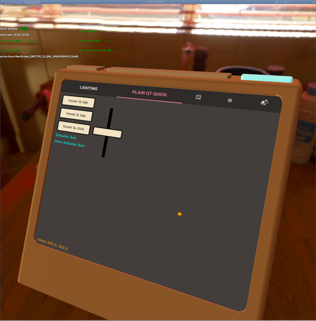
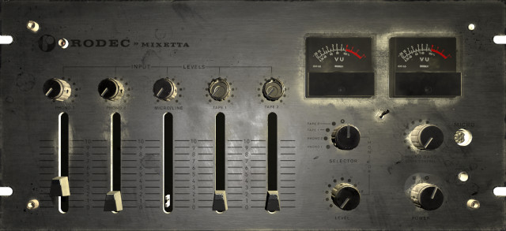

This is a demo of a new feature in Qt 6.1: you could already map a Qt Quick
sub-scene onto a 3D object, but now the interactive features work: you can
click buttons, detect hover, edit text and so on.

Also a demo of an experimental feature that isn't integrated yet: Pointer
Handlers on 3D Models, for clicking 3D buttons and such.

There's also a 
[demo video](https://d.tube/#!/v/ecloud/QmVATRbK6pDpwXwS1sTfUagpVCtdGye1v66mgonfvYTDGF)
.

Now there's also a second demo: "rigging" a 
[third-party model](https://sketchfab.com/3d-models/rodec-mixetta-mixing-console-a848812574b141d7bb2b6af2e9bdb5ee)
and making it interactive.  (Thanks João Desager!)  This depends on the same
experimental Qt feature which still has not shipped in 6.2.

A 
[presentation](https://github.com/ec1oud/qt-presentations/tree/qtquick3d-interactive-ui)
explaining the different use cases and workflows is available.

